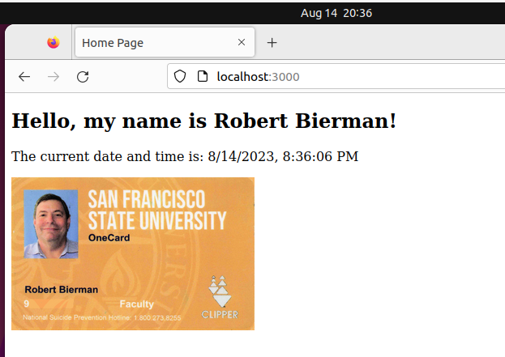

# CSC317-Assignment1-ThisIsMe
Welcome to your first homework assignment.
Take lots of screen shots as you complete each step!

This assignment is the setup of the Ubuntu image in Virtual Box and installation of some additional tools you will need.   Note on an ARM based Macintosh (M1 and M2 Mac's - Apple Silicon) you will setup Parallels verses Virtual Box, install Ubuntu, NodeJS, and Express, then follow the same instructions in the setup deck.

Do this by following the steps in the Setup PowerPoint deck on Canvas.  Take screen shots showing the steps as outlined in the setup PowerPoint deck.

You also have to clone this respository in your virtual machine.  See using github for this classroom and the setup instructions.

Then to create a webpage.  It must be by editing the home.html file in the public directory. The minimum requirements are that it display your name, the date, and a picture of your SFSU ID Card (if you don't have your ID Card, a selfie and include your SFSU ID number on the page).  The picture must be of you.

All the files are served by NodeJS using express and are in the "public" subfolder located in the same direactory as server317.js, this includes your image file!

You are welcome to add more to the page if you wish.

The HTML to add an image (and specifically I want you to use) is: 

     

This HTML specifies that you want to include an image, and the source file for that image is IDCard.jpg, and that you want the image scaled in size so that the width is 300 pixels wide. 

The HTML command ` ` will cause a line break.

To view the webpage, you need to start NodeJS by opening a terminal window and going to your git project directory  (not from within the public directory) and running the command `node server317.js` form your github directory.  Then open the firefox web browser in the virtual machine (not your host computer) and go the the URL: `http://localhost:3000/`

Have fun with the assignment as you create and serve your own web page. 

When complete, take a screen shot or photo that you will include in a PDF.

Use the provided CSC317 Writeup Template for all your writeups, located at: https://docs.google.com/document/d/1oZz74-3MDzP8TZf35k_U32eLdFn0D3BlNTcFgEz6KWM/edit

The PDF file (your writeup) should be comprised of 5 sections (and don't forget your name and student ID number and the class on the paper):

    Description of the assignment
    Approach  A  writeup of the steps you took to complete the assignment (strategy and plan)
    What issues did you have and how did you overcome them
    Analysis:  (Reflect on what you have learned and how decisions made could impact users.)
    The screen shots of the linux installation and your final webpage.

The PDF you will submit in Canvas for this assignment.

Please remember, this is the most critical assignment, because this is the environment we will use for the rest of the semester. 

Below is a sample output of the final webpage.

Hint:   The file home.html that is provided displays the current date and time.

Rubric:
| Grade Item                         | Grade Points      |
|:-----------------------------------|------------------:|
| Clear complete writeup             | 3                 |
| Descriptive Issues and Resolution  | 3                 |
| Clear Analysis                     | 5                 |
| Linux Setup Screen Shots           | 5                 |
| HTML source for webpage            | 5                 |
| Web Page Screen Shot               | 4                 |

Make sure I can see the URL from the webbrowser with the final Web Page Screen Shot

